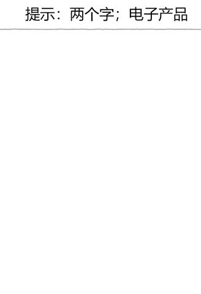
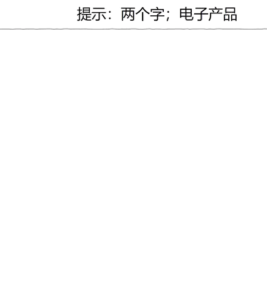
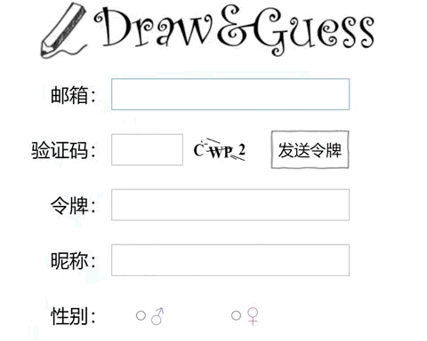
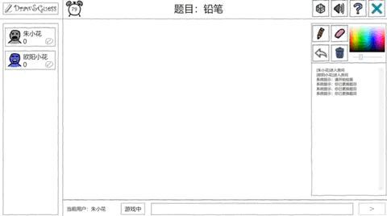
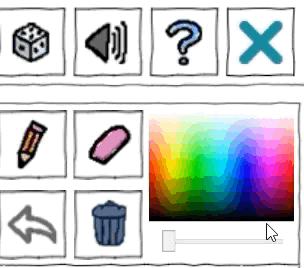
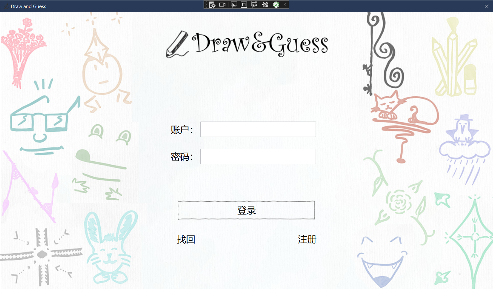
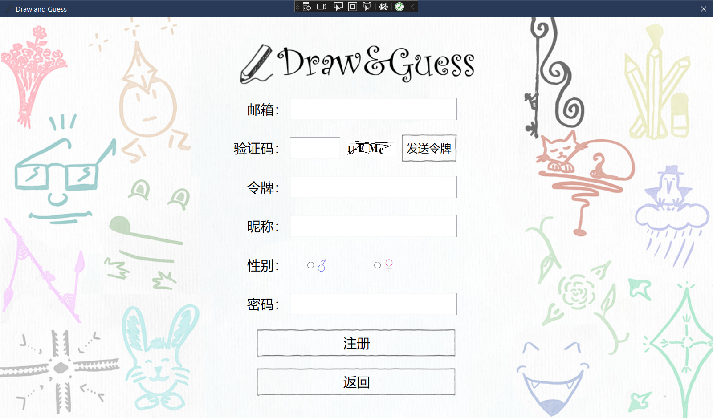
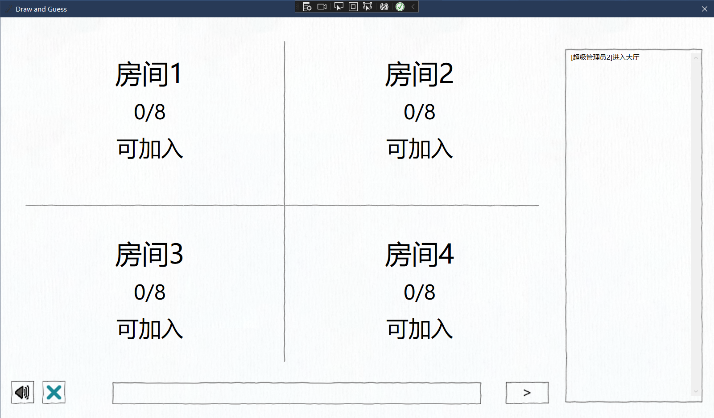
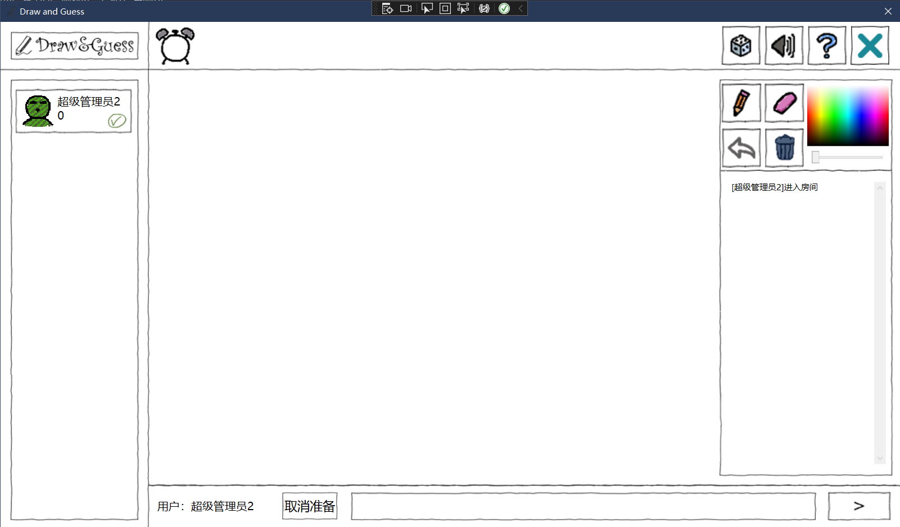

# 软件构造基础大作业——你画我猜

[English Version/英文版本](https://github.com/Cakeyan/C_sharp_Term_Project/blob/main/README_en.md)

该仓库存放了武汉大学2022春季软件构造基础（C sharp）课程的小组期末大作业。我们小组实现了一个**基于TCP连接的局域网多人在线你画我猜小游戏**，运用了WPF、WCF框架。我们小组成员如下（**同等贡献，排名不分先后，点击超链接可以访问他们的GitHub页面**）：**[Xin Yan(严鑫)](https://github.com/Cakeyan), [Wei Chen(陈伟)](https://github.com/chenwei746), [Jiaqi Deng(邓家琪)](https://github.com/oneofmyself), [Yuxuan Zhao(赵宇轩)](https://github.com/msm8976), [Hongxiao Xiang(向宏霄)](https://github.com/xhx787)**.

## 如何配置使用？

该项目使用Visual Studio 2019及2022编写。经过我们的测试，在这两个版本上可以正常运行。在`Server`与`Client`的`App.config`文件中，可以修改IP地址与端口（目前是`localhost:802`，替换`localhost`为你想要链接的IPv4地址）。局域网连接需要有一台主机启用Server，其他用户连接到启用了Server的IP地址上，就可以成功联机。

为了避免开源之后邮箱被滥用，这里我们关闭了自己的邮箱授权。您可以在`Server\LoginService.cs`中的`sendEmail()`函数里改成自己的邮箱与密码。您如果不想注册，也可以使用内置的测试账号。账号名为：**1000-1008**，密码为**123**。

## 效果展示

### 实时笔迹效果对比

#### 未实现实时笔迹（左/右：绘画者视角/猜词者视角）

#### 第一版实时笔迹（左/右：绘画者视角/猜词者视角）

#### 最终版实时笔迹（左/右：绘画者视角/猜词者视角）

### 注册演示

### 游玩演示

### 鼠标光标细节

### 登陆界面

### 注册界面

### 大厅界面

### 房间主界面

