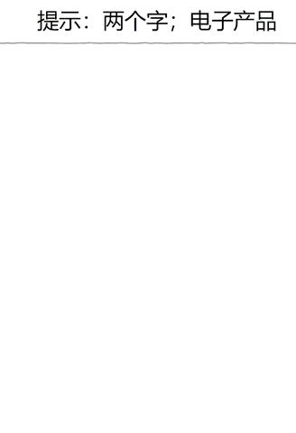
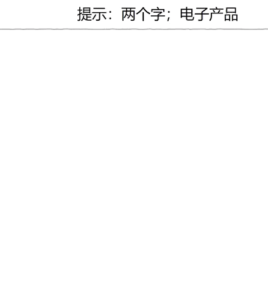
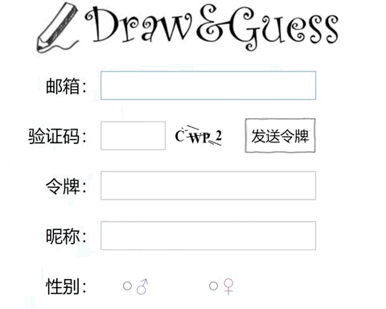
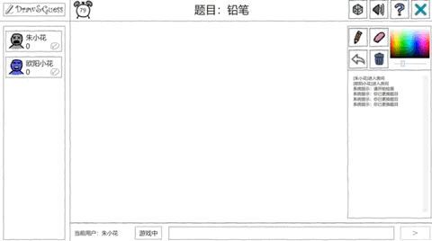
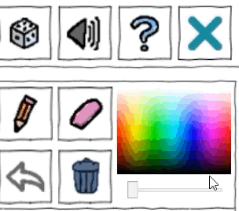
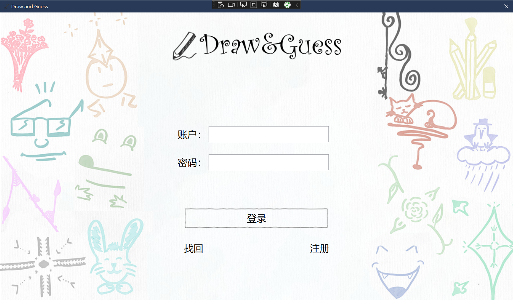
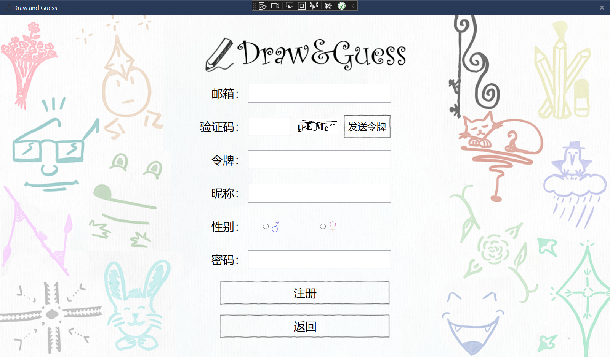
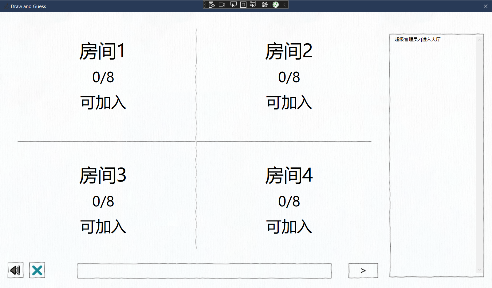
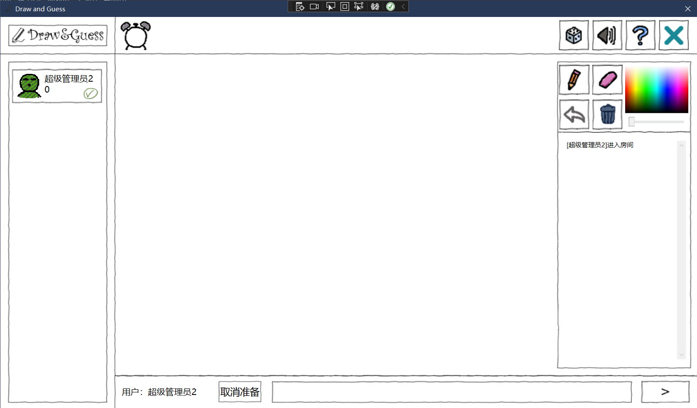

# C sharp Term Project: Draw&Guess

[中文版本/Chinese Version](https://github.com/Cakeyan/C_sharp_Term_Project/blob/main/README.md)

This is our Term Project of **Software Construction**(C sharp) in **Wuhan University** 2022 Spring. Our group has implemented a **Draw&Guess game**, based on WPF and WCF. The members of our group are(**equal contribution**, click the hyperlink to view their GitHub Page): **[Xin Yan(严鑫)](https://github.com/Cakeyan), [Wei Chen(陈伟)](https://github.com/chenwei746), [Jiaqi Deng(邓家琪)](https://github.com/oneofmyself), [Yuxuan Zhao(赵宇轩)](https://github.com/msm8976), [Hongxiao Xiang(向宏霄)](https://github.com/xhx787)**.

## TL; DR - Quick Start

This project is based on Visual Studio 2019 and 2022 and can run successfully on these two versions. You can modify the IPv4 address and port, which is `localhost:802` now, in the `App.config` file in `Server` and `Client` directory. To connect to the specified server, clients need to modify the IP address and port the same as the IPv4 address of server, and make sure the server is running. Enjoy it!

## Results

### Comparison of Real-Time-Painting

#### No Real-Time-Painting Algorithm(L/R: Painter’s View/Player’s View)

#### [First Version]Real-Time-Painting Algorithm(L/R: Painter’s View/Player’s View)

#### [Final Version]Real-Time-Painting Algorithm(L/R: Painter’s View/Player’s View)

### Register

### Painting

### Details of the cursor

### Login Window

### Register Window

### Gaming Hall Window

### Room Window

